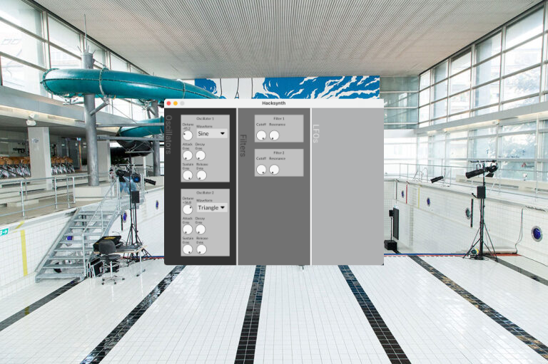

# hacksynth
> Synthesizer Project of Lian Studer & Kris Huber for `[yth22]`



## Installation
You can either download the latest binary in the [releases](https://github.com/krissemicolon/hacksynth/releases) or as described here build from source.

1. Clone the repository
```sh
git clone https://github.com/krissemicolon/hacksynth
cd hacksynth
```

2. Compile
```sh
cargo build --release
```

2.1. (Optional, macOS) Build a `Hacksynth.app`
> Requires cargo-bundle install it with `cargo install cargo-bundle`
```sh
cargo bundle --release
```

3. Running
> [!NOTE]  
> As of now this synth only takes input from MIDI Keyboards. Meaning you need to use a MIDI Keyboard to play notes.

```sh
./target/release/hacksynth
# or .app
```
or if you built a `.app`
```sh
open target/release/bundle/osx/Hacksynth.app
```
